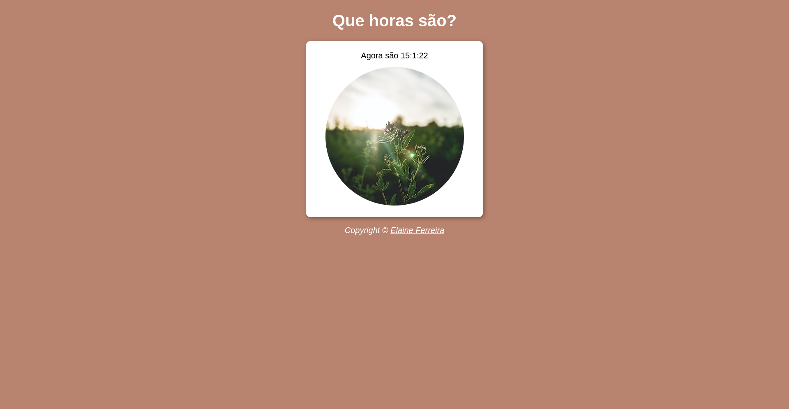

<h1 align="center">🕒 Relógio Hora Atual 🕒</h1>

<h2 align="center">

<a href="https://elainefs.github.io/hora-do-dia/" target="_blank">Ver Projeto</a>
</h2>

  
  
  

## 📘 Sobre
Site que mostra a hora, os minutos e os segundos baseados nas informações do sistema do usuário.

## 💻 Tecnologias
- HTML5
- CSS3
- JavaScript

## 📄 Licença
Este projeto está sob a licença MIT. Consulte o arquivo [LICENSE](/LICENSE) para obter mais detalhes.

Made with ❤️ by [Elaine Ferreira](https://github.com/elainefs)